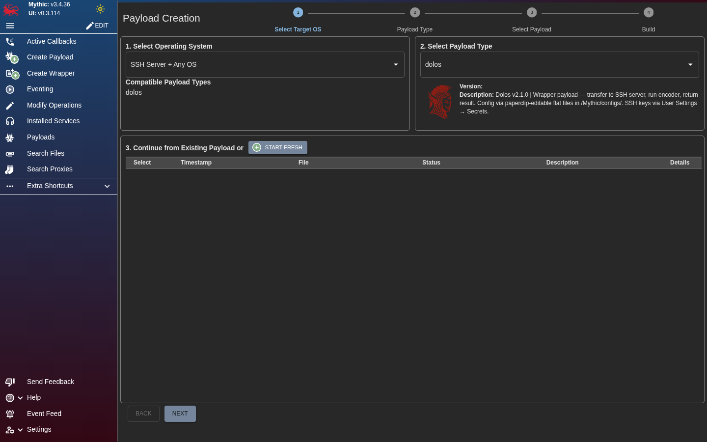
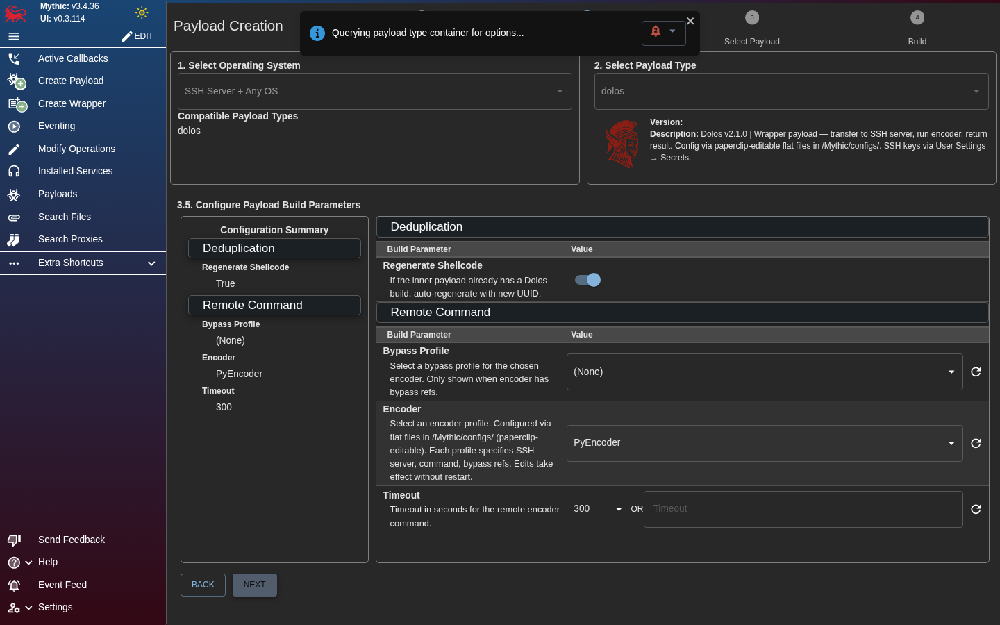
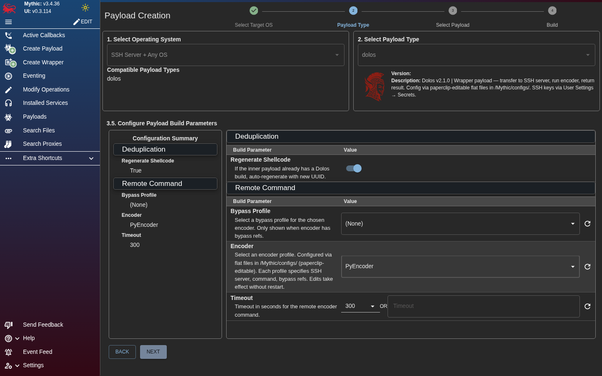
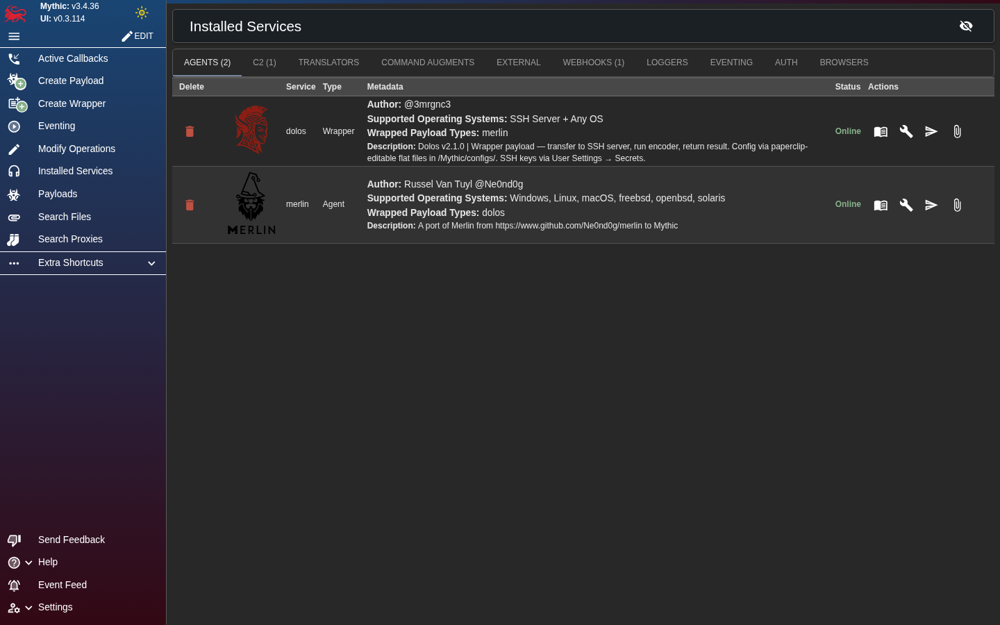
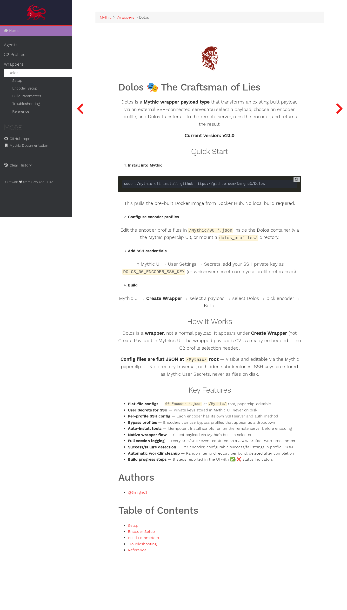
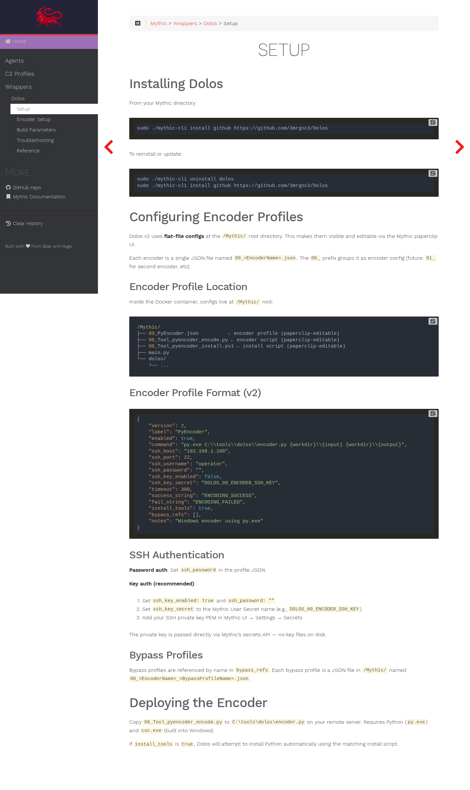

# </br> Dolos - The Craftsman of Lies

**[Mythic](https://github.com/its-a-feature/Mythic) Agent Wrapper Service type**

Dolos is **encoder-agnostic**: it supports all shellcode and processed payload types, relying on your own pre-configured remote SSH server with whatever tools you want installed. 
For example, Connect to your own licensed copy of [Balliskit's ShellcodePack](https://balliskit.com/) and have all the processing and logs ingested automatically into Mythic's database. The included PyEncoder is a starting example to demonstrate the capabilities.

---

## Screenshots

<table>
<tr>
<td width="50%"><br><em>Create Wrapper</em></td>
<td width="50%"><br><em>Build parameters</em></td>
</tr>
<tr>
<td width="50%"><br><em>Select Encoders</em></td>
<td width="50%"><br><em>Edit json Encoder/Bypass Profiles</em></td>
</tr>
<tr>
<td width="50%"><br><em>In-app documentation (Hugo)</em></td>
<td width="50%"><br><em>Setup documentation</em></td>
</tr>
</table>

---

## </br> Quick Start

### 1. Install into Mythic

```bash
sudo ./mythic-cli install github https://github.com/3mrgnc3/Dolos
```

This pulls the pre-built Docker image from Docker Hub. No local build required.

To reinstall or update:

```bash
sudo ./mythic-cli uninstall dolos
sudo ./mythic-cli install github https://github.com/3mrgnc3/Dolos
```

### 2. Configure encoder profiles

Edit the `NN_*.json` files inside the Dolos container via the Mythic **paperclip UI**.
Each profile specifies an SSH server, command template, and bypass references.
The included PyEncoder profile is a working example — configure it for your server,
or add profiles for [Balliskit ShellcodePack](https://balliskit.com/), donut, or your own tools.

### 3. Deploy your encoding tools on the remote server

Install whatever tools you need on your SSH server:
- [Balliskit ShellcodePack](https://balliskit.com/) — commercial EDR evasion with bypass profiles
- [Balliskit MacroPack](https://balliskit.com/) — Office macro generation
- donut — open-source shellcode-to-EXE converter
- Custom scripts — anything that takes input and produces output

If `install_tools: true` is set in the profile, Dolos will automatically run
install scripts on the remote server before encoding if required.

### 4. Add SSH credentials

In Mythic UI → User Settings → Secrets, add your SSH private key as
`DOLOS_NN_ENCODER_SSH_KEY`. The encoder profile's `ssh_key_secret` field references
this secret name. Alternatively, set `ssh_password` directly in the profile for development.

### 5. Create a payload

Build any payload (e.g., Apollo, Merlin) with its C2 profile.

### 6. Create a wrapper

Mythic UI → **Create Wrapper** → select Dolos → select the inner payload → choose encoder → Build.

### 7. Download the result

Get your wrapped output (EXE, DLL, shellcode bin, or whatever your encoder produces)
with a full session log (.session.json) containing every SSH/SFTP event, stdout/stderr,
exit codes, and timestamps.

---

## How It Works

Dolos is a **wrapper**, not a normal payload. It appears under **Create Wrapper** (not Create Payload)
in Mythic's UI. The wrapped payload's C2 is already embedded — no C2 profile selection needed.

### Build Pipeline

```
Operator → Mythic → Dolos container SSH  > Remote sserver
SFTP > Upload payload + files
SSH  > Run encoder command
SSH  < Log Terminal Msg in Mythic 
SFTP < Download result
SFTP > Cleanup workdir

Result (any format output) + Session log (.session.json)
```

### What Gets Logged (Session Log)

Every SSH connection event, SFTP operation (upload, download, mkdir, remove),
the exact encoder command run, line-by-line stdout/stderr, exit codes, file magic
detection, and cleanup — all with ISO 8601 timestamps and elapsed time.

---

## v2 Architecture

Dolos v2 uses **flat-file configs** at `/Mythic/` root and **Mythic User Secrets** for SSH keys:

- **No `configs/` subdirectories** — every file is at `/Mythic/` root, visible in paperclip
- **No SSH key files on disk** — private keys come from Mythic's User Secrets API
- **No scaffolding** — the image ships with a sample encoder, operators edit via paperclip
- **Encoder-agnostic** — supports all shellcode and processed payload types via any SSH-accessible tool

### Config Directory

```
/Mythic/
├── 00_PyEncoder.json              ← included example encoder profile (paperclip-editable)
├── 00_Tool_pyencoder_encode.py    ← included example encoder script (paperclip-editable)
├── 00_Tool_pyencoder_install.ps1 ← included example install script (paperclip-editable)
├── 01_ShellcodePack.json          ← Balliskit encoder profile (add your own)
├── 01_Tool_shellcodepack_install.ps1 ← Balliskit install script (add your own)
├── 01_Bypass_AMSI.json            ← bypass profile (add your own)
├── main.py
└── dolos/
    ├── __init__.py
    ├── agent_functions/
    │   └── builder.py
    ├── config_loader.py
    ├── ssh_client.py
    └── hasura.py
```

Private keys and passwords are **never stored on disk** — they come from Mythic's User
Secrets API at build time. The included PyEncoder profile has placeholder credentials
for development. Operators customize via paperclip.

---

## Changelog

- **v2.1.1** — Encoder-agnostic documentation rewrite: Balliskit ShellcodePack/MacroPack examples, restored detailed setup/encoder/troubleshooting docs, expanded payload_output to reflect all supported formats.
- **v2.1.0** — Clean public release. Screenshots, user guide, E2E tests.
- **v2.0.0** — Flat-file configs at `/Mythic/` root. Mythic User Secrets for SSH keys. Paperclip-editable. Fixed sync spam bug.
- **v1.0.9** — Author sticker, `rabbitmq_config.json` with correct Docker service names.
- **v1.0.8** — Rebuilt from clean source to verify all fixes.
- **v1.0.7** — Fix syntax error in main.py.
- **v1.0.6** — Remove custom env vars from config.json that caused Docker Compose warnings.
- **v1.0.5** — Remove harmful `rabbitmq_config.json`, fix local dev fallback.
- **v1.0.4** — Public release. Removed dev tools, config templates. Fresh Docker build.
- **v1.0.3** — MythicMeta-compliant repo structure, pre-built Docker Hub image, Apache 2.0 license.
- **v1.0.0** — Initial public release. Remote encoder via SSH/SFTP, session logging, config hot-reload.
- **v0.13.0** — Auto-install tools on remote servers. Success/fail strings in profile JSON. ChooseOneCustom timeout.
- **v0.11.0** — File-based multi-profile config. Per-profile SSH, bypass profiles, auto-scaffold.
- **v0.10.0** — Shellcode deduplication via Hasura + MythicRPC. Auto-rebuild with fresh UUID.
- **v0.9.0** — SSH key authentication. `Regenerate Shellcode` build param.
- **v0.5.1** — `resp.payload` lowercase fix.

---

## License

Apache License 2.0 — see [LICENSE](LICENSE).

## Authors

- [@3mrgnc3](https://github.com/3mrgnc3/Dolos)
